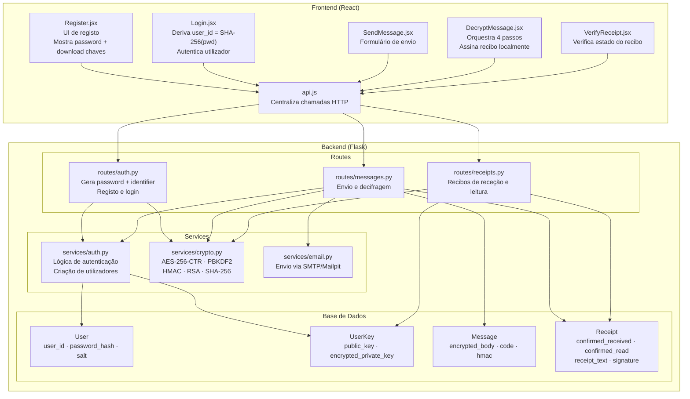

# Arquitetura — Módulos e Responsabilidades

## Responsabilidades

| Módulo | Responsabilidade |
| --- | --- |
| `Register.jsx` | UI de registo; mostra password gerada e faz download das chaves |
| `Login.jsx` | Deriva `user_id = SHA-256(password)` localmente antes de autenticar |
| `SendMessage.jsx` | Formulário de envio de mensagem cifrada |
| `DecryptMessage.jsx` | Orquestra os 4 passos; assina recibo com Web Crypto API sem enviar chave privada |
| `VerifyReceipt.jsx` | Permite ao emissor verificar se a mensagem foi lida e se a assinatura é válida |
| `api.js` | Centraliza todas as chamadas HTTP; lança erro se resposta não for 2xx |
| `routes/auth.py` | Gera password + identifier no registo; cria sessão no login |
| `routes/messages.py` | Cifra e guarda mensagens; decifra e gera receipt_text |
| `routes/receipts.py` | Confirma receção e leitura; verifica assinatura RSA do recibo |
| `services/auth.py` | Cria utilizadores na BD; verifica credenciais com PBKDF2 |
| `services/crypto.py` | Toda a criptografia: AES-256-CTR, PBKDF2, HMAC, RSA, SHA-256 |
| `services/email.py` | Envia email com código e corpo cifrado via SMTP |
| `models.py` | Define User, UserKey, Message, Receipt (SQLAlchemy) |
