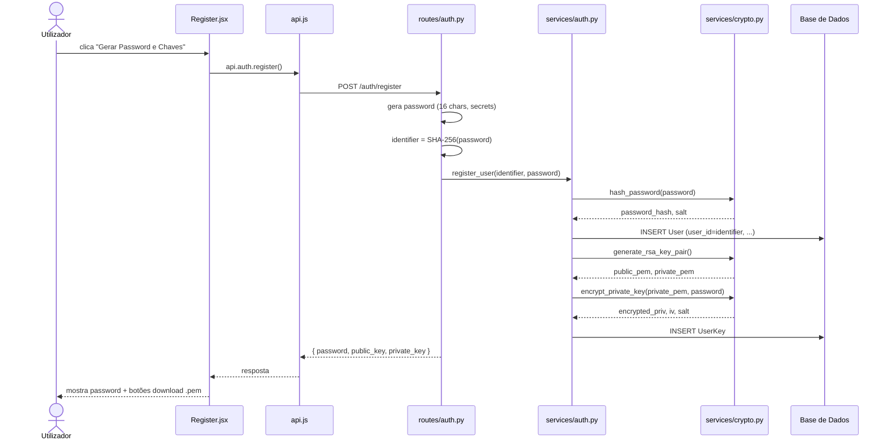

# Fluxo de Registo

```mermaid
sequenceDiagram
    actor U as Utilizador
    participant R as Register.jsx
    participant A as api.js
    participant RA as routes/auth.py
    participant SA as services/auth.py
    participant C as services/crypto.py
    participant DB as Base de Dados

    U->>R: clica "Gerar Password e Chaves"
    R->>A: api.auth.register()
    A->>RA: POST /auth/register
    RA->>RA: gera password (16 chars, secrets)
    RA->>RA: identifier = SHA-256(password)
    RA->>SA: register_user(identifier, password)
    SA->>C: hash_password(password)
    C-->>SA: password_hash, salt
    SA->>DB: INSERT User (user_id=identifier, ...)
    SA->>C: generate_rsa_key_pair()
    C-->>SA: public_pem, private_pem
    SA->>C: encrypt_private_key(private_pem, password)
    C-->>SA: encrypted_priv, iv, salt
    SA->>DB: INSERT UserKey
    RA-->>A: { password, public_key, private_key }
    A-->>R: resposta
    R-->>U: mostra password + botões download .pem
```
