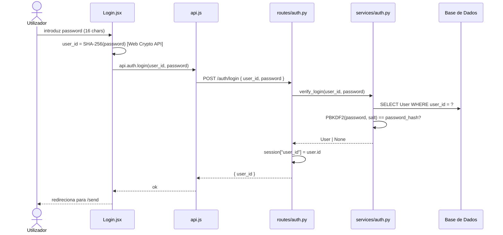

# Fluxo de Login

```mermaid
sequenceDiagram
    actor U as Utilizador
    participant L as Login.jsx
    participant A as api.js
    participant RA as routes/auth.py
    participant SA as services/auth.py
    participant DB as Base de Dados

    U->>L: introduz password (16 chars)
    L->>L: user_id = SHA-256(password)  [Web Crypto API]
    L->>A: api.auth.login(user_id, password)
    A->>RA: POST /auth/login { user_id, password }
    RA->>SA: verify_login(user_id, password)
    SA->>DB: SELECT User WHERE user_id = ?
    SA->>SA: PBKDF2(password, salt) == password_hash?
    SA-->>RA: User | None
    RA->>RA: session["user_id"] = user.id
    RA-->>A: { user_id }
    A-->>L: ok
    L-->>U: redireciona para /send
```
