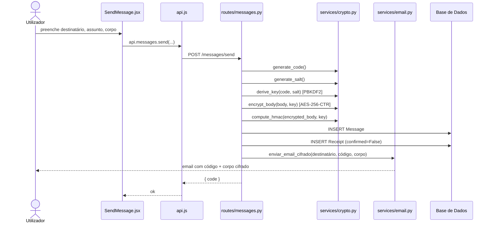

# Fluxo de Envio de Mensagem

```mermaid
sequenceDiagram
    actor U as Utilizador
    participant S as SendMessage.jsx
    participant A as api.js
    participant RM as routes/messages.py
    participant C as services/crypto.py
    participant E as services/email.py
    participant DB as Base de Dados

    U->>S: preenche destinatário, assunto, corpo
    S->>A: api.messages.send(...)
    A->>RM: POST /messages/send
    RM->>C: generate_code()
    RM->>C: generate_salt()
    RM->>C: derive_key(code, salt)  [PBKDF2]
    RM->>C: encrypt_body(body, key)  [AES-256-CTR]
    RM->>C: compute_hmac(encrypted_body, key)
    RM->>DB: INSERT Message
    RM->>DB: INSERT Receipt (confirmed=False)
    RM->>E: enviar_email_cifrado(destinatário, código, corpo)
    E-->>U: email com código + corpo cifrado
    RM-->>A: { code }
    A-->>S: ok
```
