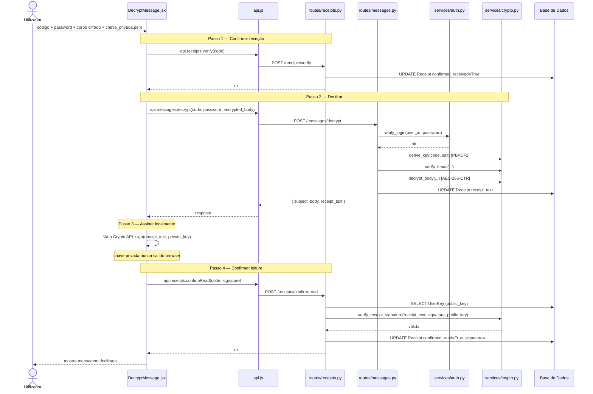

# Fluxo de Decifragem

```mermaid
sequenceDiagram
    actor U as Utilizador
    participant D as DecryptMessage.jsx
    participant A as api.js
    participant RR as routes/receipts.py
    participant RM as routes/messages.py
    participant SA as services/auth.py
    participant C as services/crypto.py
    participant DB as Base de Dados

    U->>D: código + password + corpo cifrado + chave_privada.pem

    Note over D,RR: Passo 1 — Confirmar receção
    D->>A: api.receipts.verify(code)
    A->>RR: POST /receipts/verify
    RR->>DB: UPDATE Receipt confirmed_received=True
    RR-->>D: ok

    Note over D,C: Passo 2 — Decifrar
    D->>A: api.messages.decrypt(code, password, encrypted_body)
    A->>RM: POST /messages/decrypt
    RM->>SA: verify_login(user_id, password)
    SA-->>RM: ok
    RM->>C: derive_key(code, salt)  [PBKDF2]
    RM->>C: verify_hmac(...)
    RM->>C: decrypt_body(...)  [AES-256-CTR]
    RM->>DB: UPDATE Receipt.receipt_text
    RM-->>A: { subject, body, receipt_text }
    A-->>D: resposta

    Note over D: Passo 3 — Assinar localmente
    D->>D: Web Crypto API: sign(receipt_text, private_key)
    Note over D: chave privada nunca sai do browser

    Note over D,RR: Passo 4 — Confirmar leitura
    D->>A: api.receipts.confirmRead(code, signature)
    A->>RR: POST /receipts/confirm-read
    RR->>DB: SELECT UserKey (public_key)
    RR->>C: verify_receipt_signature(receipt_text, signature, public_key)
    C-->>RR: válida
    RR->>DB: UPDATE Receipt confirmed_read=True, signature=...
    RR-->>D: ok
    D-->>U: mostra mensagem decifrada
```
