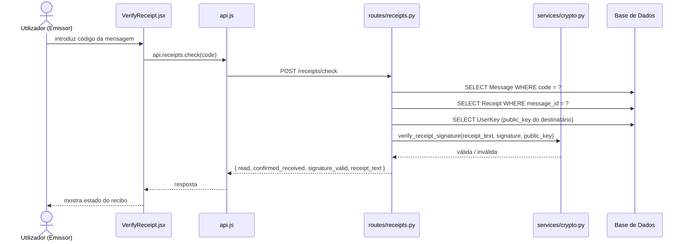

# Fluxo de Verificação de Recibo

```mermaid
sequenceDiagram
    actor U as Utilizador (Emissor)
    participant V as VerifyReceipt.jsx
    participant A as api.js
    participant RR as routes/receipts.py
    participant C as services/crypto.py
    participant DB as Base de Dados

    U->>V: introduz código da mensagem
    V->>A: api.receipts.check(code)
    A->>RR: POST /receipts/check
    RR->>DB: SELECT Message WHERE code = ?
    RR->>DB: SELECT Receipt WHERE message_id = ?
    RR->>DB: SELECT UserKey (public_key do destinatário)
    RR->>C: verify_receipt_signature(receipt_text, signature, public_key)
    C-->>RR: válida / inválida
    RR-->>A: { read, confirmed_received, signature_valid, receipt_text }
    A-->>V: resposta
    V-->>U: mostra estado do recibo
```
