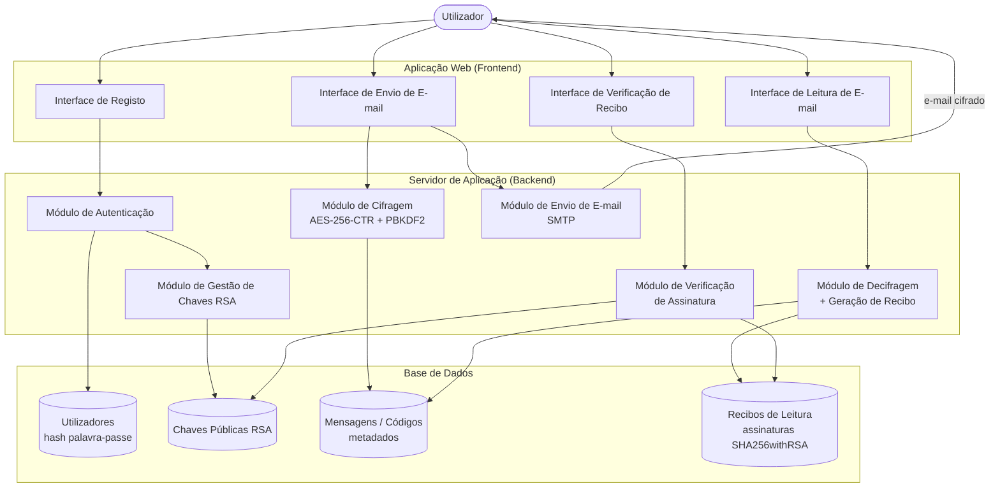
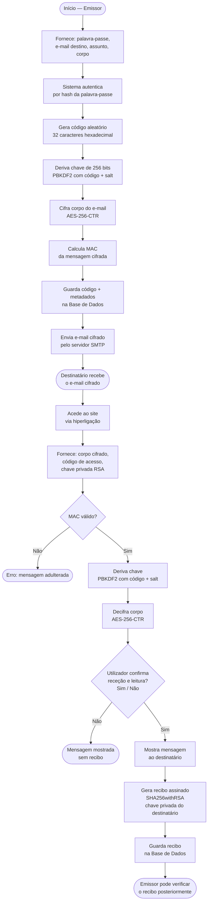
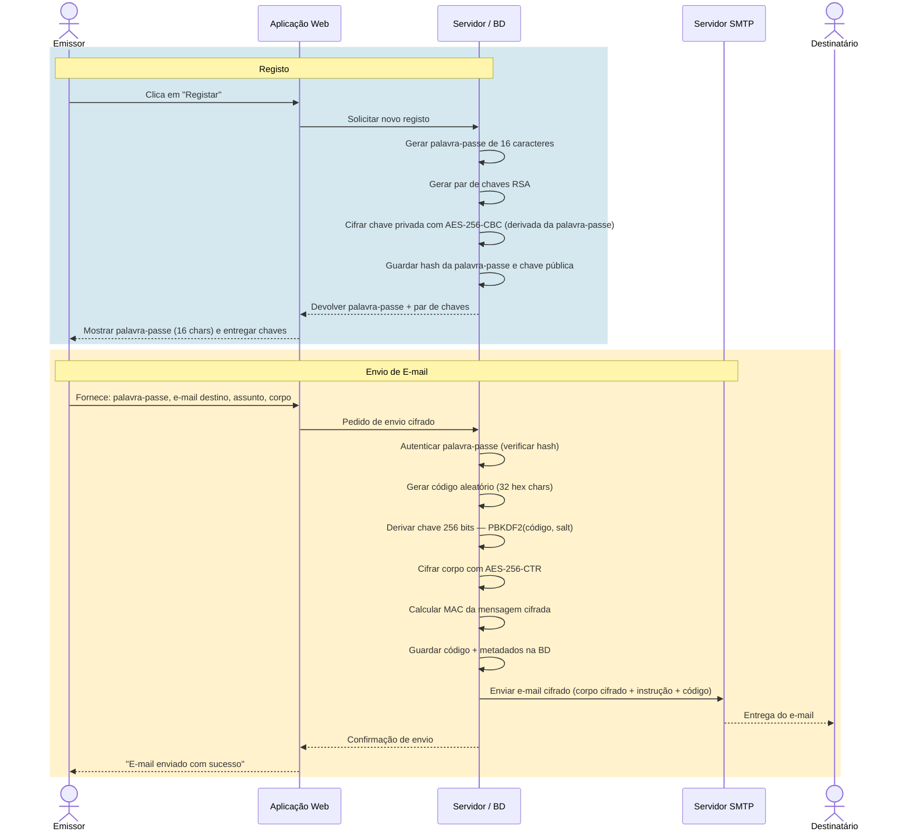
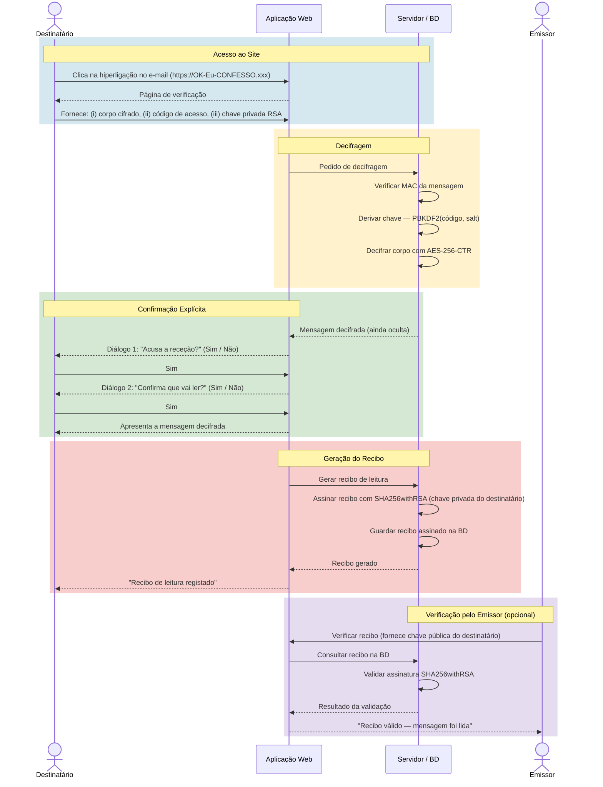

# OK-Eu-CONFESSO — Diagramas de Arquitetura

---

## 1. Diagrama de Componentes

---

## 2. Fluxo Completo de Cifragem / Decifragem

---

## 3. Diagrama de Sequência — Cenário 1: Registo e Envio

---

## 4. Diagrama de Sequência — Cenário 2: Leitura e Recibo

